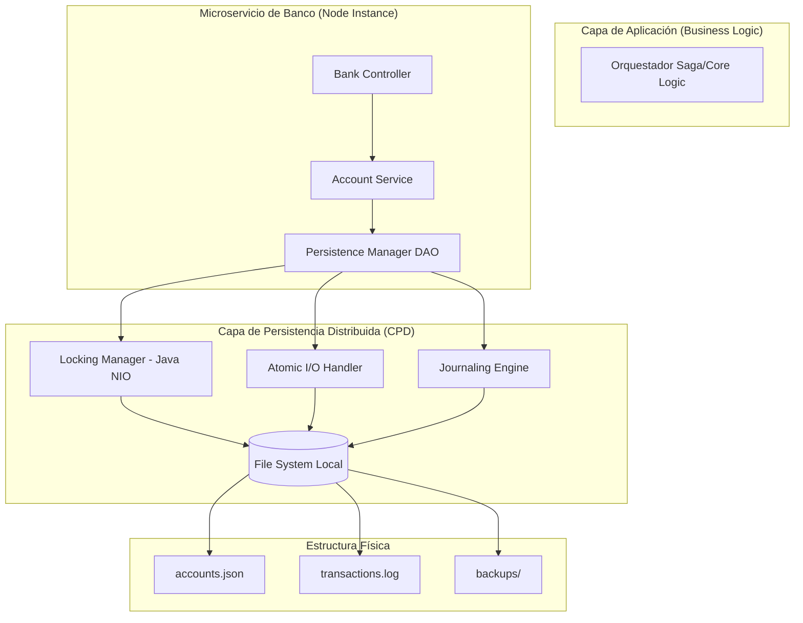

# Capa de Persistencia Distribuida (CPD)

## 1. Objetivos y Alcance del Módulo

### 1.1. Objetivo Principal
El objetivo fundamental de la CPD es proveer un motor de almacenamiento de grado bancario basado estrictamente en el sistema de archivos (File System), garantizando las propiedades **ACID** (Atomicidad, Consistencia, Aislamiento y Durabilidad) en un entorno de microservicios distribuidos sin dependencia de bases de datos relacionales o NoSQL.

### 1.2. Alcance Técnico
*   **Gestión de Estado Financiero:** Control absoluto sobre los saldos y metadatos de cuentas y clientes.
*   **Control de Concurrencia:** Implementación de mecanismos de exclusión mutua para prevenir condiciones de carrera en operaciones de crédito/débito simultáneas.
*   **Auditabilidad Total:** Registro inmutable de cada cambio de estado para fines de cumplimiento y reconstrucción de saldos.
*   **Resiliencia Operativa:** Mecanismos de recuperación ante fallos críticos de hardware o interrupciones de procesos durante escrituras I/O.

---

## 2. Arquitectura General y Modelo de Integración

La arquitectura se basa en el principio de **Soberanía Local de Datos**. Cada nodo bancario es el único custodio de su sistema de archivos, interactuando con los demás componentes exclusivamente a través de servicios de aplicación.

### 2.1. Diagrama de Arquitectura de Persistencia (Mermaid)



### 2.2. Modelo de Integración
La integración de la CPD con la lógica de negocio se realiza mediante el patrón **Data Access Object (DAO)**. Los servicios de negocio no manipulan archivos directamente; invocan métodos atómicos que encapsulan la complejidad de apertura, bloqueo, escritura y liberación de recursos.

| Propiedad | Mecanismo de Implementación |
| :--- | :--- |
| **Atomicidad** | Técnica de *Shadow Paging* (Escritura en archivos temporales + Rename). |
| **Consistencia** | Validaciones de esquema JSON antes del *Flush* a disco. |
| **Aislamiento** | Bloqueo pesimista mediante `FileChannel.lock()` de Java NIO. |
| **Durabilidad** | Forzado de sincronización física a disco (`FileDescriptor.sync()`). |

---

## 3. Organización de Directorios y Responsabilidades

Para mantener la consistencia entre los tres bancos (`bank-a`, `bank-b`, `bank-c`), se establece una estructura jerárquica estandarizada. El incumplimiento de esta estructura por parte de los equipos de despliegue invalidará los mecanismos de recuperación automática.

### 3.1. Estructura de Carpetas del Nodo
Cada instancia de banco deberá contar con un volumen montado en la ruta raíz de datos configurada en el `application.yml`:

```text
/data/bank_storage/
├── identity/               # Datos maestros de clientes (Solo lectura en transacciones)
│   └── clients.json
├── ledger/                 # Estado actual de liquidez (Lectura/Escritura crítica)
│   ├── accounts.json
│   └── .accounts.json.lock # Archivo de semáforo (Lock dinámico)
├── journal/                # Registro histórico (Append-only)
│   └── transactions.log
└── recovery/               # Backups y estados temporales
    ├── snapshots/          # Copias históricas de accounts.json
    └── shadow_files/       # Archivos temporales de escritura (.tmp)
```

### 3.2. Matriz de Responsabilidades de Componentes

| Componente | Responsabilidad Principal | Restricción Técnica |
| :--- | :--- | :--- |
| **Identity Manager** | Proveer datos del cliente para validaciones de pertenencia. | Los archivos en `/identity/` son estáticos durante la transacción. |
| **Ledger Engine** | Actualizar saldos de cuentas de forma atómica. | Prohibido modificar `/ledger/` sin adquirir un `Exclusive Lock`. |
| **Journaler** | Escribir la bitácora de eventos (Event Sourcing). | Solo permite operaciones *Append*. Nunca se borran registros. |
| **Locking Manager** | Gestionar los semáforos del sistema de archivos. | Debe liberar los locks incluso en caso de excepción (Runtime Error). |
| **Recovery Agent** | Realizar Snapshots y restaurar datos tras un crash. | Solo se activa durante el arranque del servicio o en fallos críticos. |

