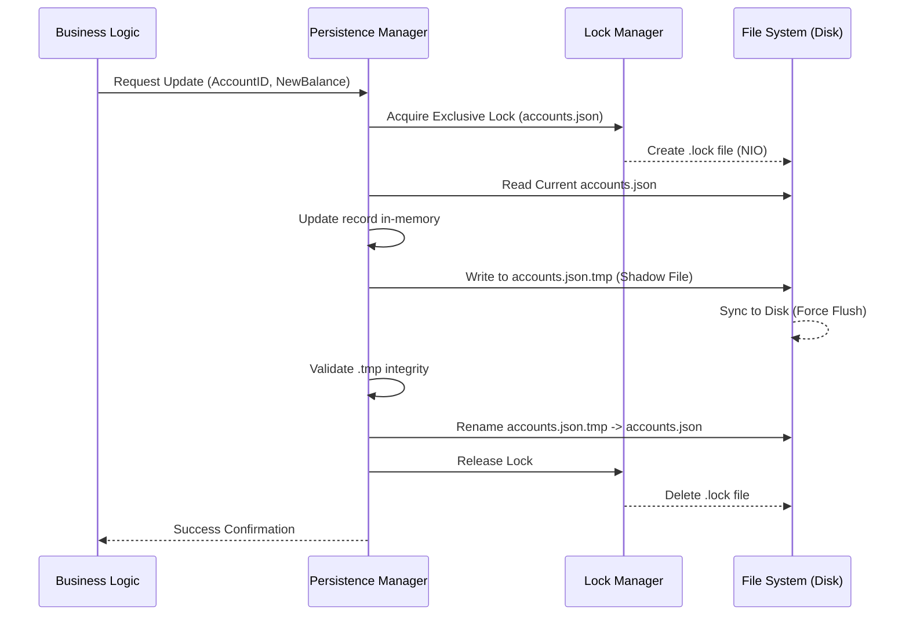

## 4. Modelos de Datos y Formatos de Archivos

Para garantizar la interoperabilidad, todos los nodos bancarios deben seguir estrictamente los siguientes esquemas JSON. Se prohíbe la adición de campos personalizados sin previa aprobación del Comité de Arquitectura.

### 4.1. Entidad: Cuenta Bancaria (`accounts.json`)
Este archivo reside en `/ledger/` y representa el balance actual.

| Campo | Tipo | Descripción | Ejemplo |
| :--- | :--- | :--- | :--- |
| `accountId` | String (UUID) | Identificador único global de la cuenta. | `"A-1001"` |
| `clientId` | String (UUID) | ID del cliente propietario (FK a `clients.json`). | `"C-001"` |
| `type` | Enum | Tipo de producto: `SAVINGS`, `CHECKING`. | `"SAVINGS"` |
| `balance` | BigDecimal | Saldo con precisión de 2 decimales. | `1500.50` |
| `currency` | String (ISO) | Código de moneda. | `"PEN"` |
| `status` | Enum | Estado operativo: `ACTIVE`, `LOCKED`, `CLOSED`. | `"ACTIVE"` |
| `updatedAt` | Timestamp | Fecha y hora del último movimiento (ISO-8601). | `"2023-10-27T10:00Z"` |

### 4.2. Entidad: Cliente (`clients.json`)
Ubicado en `/identity/`, este archivo es de carácter maestro y referencial.

```json
{
  "clientId": "C-001",
  "fullName": "Juan Pérez",
  "documentId": "45678912",
  "email": "juan.perez@email.com",
  "homeBank": "BANK_A"
}
```

---

## 5. Flujo de Lectura, Escritura y Actualización Atómica

Para evitar la corrupción de datos durante una caída del sistema, la CPD no sobreescribe archivos directamente. Se implementa la técnica de **Shadow Paging** (Escritura en Sombra).

### 5.1. Diagrama de Flujo de Actualización Atómica (Mermaid)



### 5.2. Pasos del Proceso
1.  **Lectura:** Solo se permite lectura directa si no existe un archivo `.lock`. Si existe, la lectura debe esperar (Retry Policy).
2.  **Escritura Temporal:** El nuevo estado se escribe en un archivo `.tmp`. Esto asegura que si el proceso muere durante la escritura, el archivo original `accounts.json` permanece intacto.
3.  **Renombrado (Commit):** La operación de renombrado de archivo en sistemas operativos modernos es atómica. Este es nuestro punto de **Commit**.

---

## 6. Estrategias de Control de Concurrencia (Locking)

Dado que el enunciado establece que cada banco almacena sus cuentas en archivos, el acceso concurrente es el riesgo más alto. Implementamos un **Bloqueo Pesimista (Pessimistic Locking)**.

### 6.1. Bloqueo a Nivel de Nodo (File-Level Lock)
En esta fase, debido a que todas las cuentas de un banco residen en un único archivo (`accounts.json`), el bloqueo se aplica a **todo el archivo** durante una transacción.

| Tipo de Lock | Mecanismo Java | Aplicación |
| :--- | :--- | :--- |
| **Shared Lock (Read)** | `FileChannel.lock(0, MAX, true)` | Permite que múltiples hilos lean saldos, pero impide que alguien escriba. |
| **Exclusive Lock (Write)** | `FileChannel.lock(0, MAX, false)` | Impide que cualquier otro hilo lea o escriba mientras se actualiza el saldo. |

### 6.2. Gestión de Timeouts y Deadlocks
*   **Timeout:** Ningún hilo puede retener un lock por más de **2000ms**. Si una operación excede este tiempo, el `LockManager` forzará la liberación y lanzará una `StorageTimeoutException`.
*   **Retry Policy:** Si un microservicio intenta adquirir un lock y este está ocupado, implementará un **Exponential Backoff** (espera exponencial) con un máximo de 3 reintentos antes de abortar la transacción y notificar al Orquestador Saga.

### 6.3. Interfaz de Bloqueo para Desarrolladores
Los equipos de lógica de negocio deberán utilizar el bloque `try-with-resources` para asegurar la liberación del lock:

```java
// Ejemplo de uso mandatorio para Equipo 2
try (FileLock lock = persistenceManager.acquireWriteLock()) {
    // La lógica de actualización ocurre aquí
    persistenceManager.commitUpdate(accountDto);
} catch (LockAcquisitionException e) {
    // Manejo de reintentos o rollback
}
```
