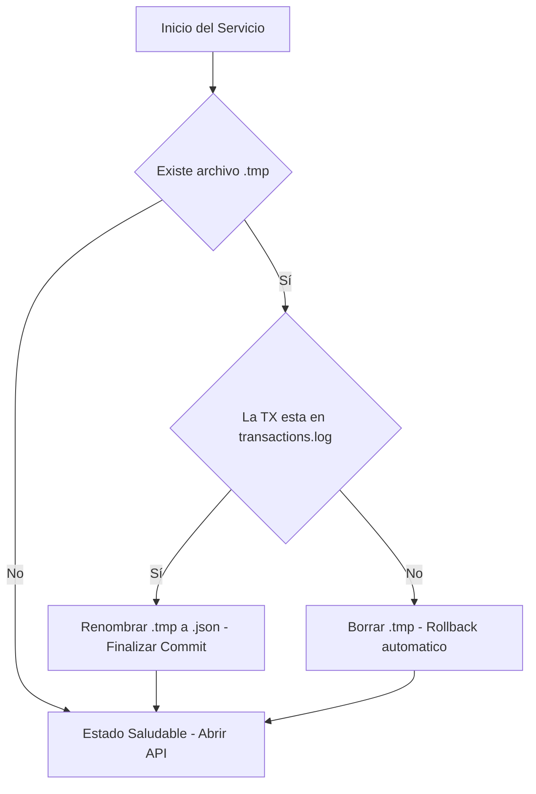

## 7. Mecanismos de Consistencia, Atomicidad y Recuperación

Dado que no contamos con el soporte de transacciones nativas de una base de datos, la CPD implementa una **Gestión de Transacciones Basada en Archivos** que emula el comportamiento de un motor transaccional.

### 7.1. Garantía de Atomicidad (El Principio de "Todo o Nada")
Para asegurar que una actualización de saldo sea atómica, se utiliza el protocolo de **Confirmación en Dos Fases Local**:
1.  **Fase de Preparación:** Se genera el archivo `accounts.json.tmp`. Si el sistema falla aquí, el archivo original permanece intacto.
2.  **Fase de Commit:** Se ejecuta la operación `Files.move()` con la opción `REPLACE_EXISTING` y `ATOMIC_MOVE`. Si el sistema falla antes de esta operación, al reiniciar se descarta el `.tmp`.

### 7.2. Proceso de Recuperación Automática al Arranque (Boot-up Recovery)
Cada vez que un nodo bancario se inicia, el `PersistenceManager` ejecuta una rutina de diagnóstico antes de abrir el servicio a peticiones externas.

---

## 8. Proceso de Auditoría mediante el Ledger Inmutable (Journaling)

El archivo `transactions.log` (ubicado en `/journal/`) es la **única fuente de verdad** (Single Source of Truth). Mientras que el archivo JSON representa el estado actual, el Ledger representa la historia que explica dicho estado.

### 8.1. Propiedades del Journal
*   **Append-Only:** Está estrictamente prohibido modificar o eliminar líneas existentes. Solo se permiten inserciones al final del archivo.
*   **Integridad por Checksum:** Cada entrada incluye un código hash que valida la integridad de los datos registrados, impidiendo alteraciones manuales de los logs.

### 8.2. Estructura Estándar del Registro de Auditoría
El formato es texto plano estructurado (delimited) para facilitar el parsing rápido y la durabilidad a largo plazo.

| Columna | Descripción | Ejemplo |
| :--- | :--- | :--- |
| `TIMESTAMP` | Fecha y hora en formato ISO-8601 con milisegundos. | `2023-10-27T14:30:05.123Z` |
| `TX_ID` | ID único de la transacción (provisto por el Orquestador). | `TX-998877` |
| `ACC_ID` | Cuenta afectada por el movimiento. | `A-1001` |
| `OP_TYPE` | Naturaleza del movimiento: `DEBIT`, `CREDIT`, `REVERSAL`. | `DEBIT` |
| `AMOUNT` | Monto de la operación. | `250.00` |
| `PREV_BAL` | Saldo antes de la operación (Crucial para auditoría). | `1500.00` |
| `NEW_BAL` | Saldo resultante tras la operación. | `1250.00` |
| `CHECKSUM` | Hash SHA-256 de los campos anteriores. | `7a8b...3f` |

---

## 9. Respaldo, Restauración y Reconciliación

La CPD debe ser capaz de recuperarse de errores catastróficos (ej. borrado accidental del archivo `accounts.json`) mediante una estrategia de respaldo multinivel.

### 9.1. Estrategia de Snapshots (Respaldos en Caliente)
El sistema realiza copias automáticas en la carpeta `/recovery/snapshots/` siguiendo esta política:

| Tipo de Respaldo | Disparador (Trigger) | Retención |
| :--- | :--- | :--- |
| **Transaction Snapshot** | Cada 100 transacciones exitosas. | Últimos 5 archivos. |
| **Daily Snapshot** | Tarea programada (00:00 hrs). | Últimos 30 días. |
| **Pre-Update Backup** | Antes de cambios masivos o mantenimiento. | Manual. |

### 9.2. Proceso de Reconciliación (Data Reconciliation)
Este proceso es vital en sistemas distribuidos para asegurar que el Banco A y el Banco B estén de acuerdo sobre una transferencia.

**Flujo de Reconciliación:**
1.  **Extracción:** Se leen los `transactions.log` de los 3 bancos.
2.  **Matching:** Se buscan registros con el mismo `TX_ID` en diferentes bancos.
3.  **Identificación de Huérfanos:**
    *   *Escenario:* El Banco A tiene un `DEBIT` de la `TX-100`, pero el Banco B no tiene el `CREDIT` correspondiente.
    *   *Acción:* El sistema de reconciliación notifica al Orquestador para ejecutar una **Compensación de Emergencia** (Devolver el dinero al Banco A).

### 9.3. Restauración de Desastres (Full Recovery)
En caso de pérdida total del archivo de saldos, el procedimiento es:
1.  Cargar el último **Snapshot** válido de la cuenta.
2.  Identificar en el `transactions.log` la marca de tiempo del snapshot.
3.  **Replay:** Ejecutar todas las transacciones del log posteriores a esa marca de tiempo hasta llegar al presente.
4.  Generar el nuevo `accounts.json` validado.
